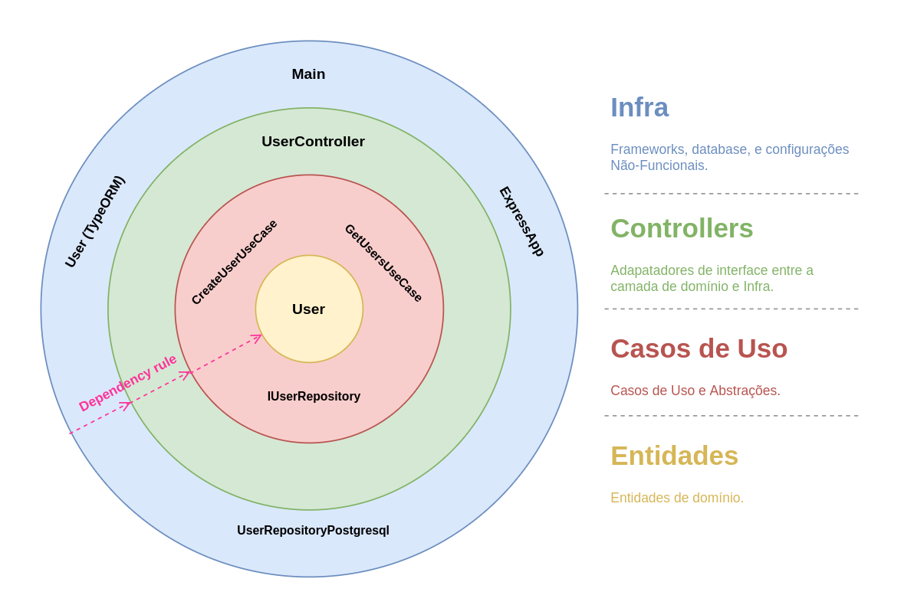

# Clean Architecture Node.js API
> Projeto criado na TechTalk - Clean Architecture com Node.js

## Requisitos

### Requisitos Funcionais
> Devem ser mapeados as funcionalidades com a visão do usuário final.

- Criar usuário
- Listar Usuários

### Requisitos Não-Funcionais
> Devem ser mapeados os requisitos na visão do desenvolvedor para atender as funcionalidades.

- Utilizar express para criação das rotas da API REST
- Utilizar banco de dados relacional para persistir dos dados da aplicação

## Arquitetura

- __Clean Architecture:__
estrutura da aplicação segue os padrões da [Clean Architecture](https://blog.cleancoder.com/uncle-bob/2012/08/13/the-clean-architecture.html).

## Stack

### Geral
> Frameworks e bibliotecas utilizadas na aplicação.

- __Typescript:__
é a linguagem padrão para projetos Node.js, pois permite uma arquitetura mais robusta, padrões de projeto, e boas práticas.

- __Express:__
é o framework utilizado na construção da API REST.

- __Swagger:__
todas os endpoints são documentados utilizando o `Swagger`.

- __Postgresql:__
o SGBD utilizado na camada de dados é o `Postgresql`.

- __TypeORM:__
o ORM utilizado na camada de dados é o `TypeORM`.

### CI/CD
> [Integração Contínua](https://www.atlassian.com/br/continuous-delivery/continuous-integration)

- __ESlint:__
para análise de código (Linting), usando como base o preset `airbnb`.

- __Husky:__
para git hooks, como rodar os testes sempre antes de um git commit.

- __Jest:__
os testes unitários e de integração utilizam o framework `Jest`.

## Author

Danilo Sampaio (jose.sampaio@venturus.org.br)
